# Stock API Service (Yii3 Showcase)

This project is a REST API showcase built with **Yii3**.
It demonstrates backend architecture, domain design, and infrastructure practices
using a simple stock and city domain with location-based features.

The implementation focuses on clear structure, well-defined layer boundaries,
and integration of common backend concerns such as persistence, API documentation,
and observability.

The project is based on [this technical task](./REST-API-TASK.md).

## 🛠 Tech Stack

- **Runtime**: [FrankenPHP](https://frankenphp.dev/) (PHP 8.4)
- **Framework**: [Yii3 Framework](https://github.com/yiisoft/app-api) (Beta)
- **Database**: PostgreSQL + **PostGIS** (for spatial queries)
- **ORM**: CycleORM (Data Mapper, Proxy support)
- **Cache**: Redis
- **Observability**:
    - **Logs**: Vector + OpenObserve
    - **Metrics**: InfluxDB + Telegraf + Grafana
- **Documentation**: OpenAPI (generated) + Stoplight Elements

## 🏗 Architecture

The project follows a hybrid of **Clean Architecture** and **DDD** principles to ensure maintainability and testability:

- **CQRS & Command Bus**: All state-changing operations are handled via a strict Command/Handler pattern.
- **Data Mapper Pattern**: Entities are decoupled from the database schema using CycleORM.
- **Domain-Driven Design**: Logic is encapsulated within Domain Entities and Services.
- **Infrastructure Isolation**: External dependencies (Metrics, Logging, Sockets) are abstracted behind interfaces.
- **Events**: Applied selectively to handle secondary concerns such as cache invalidation.

> **Note**  
> This architecture emphasizes explicit structure and exploration of Yii3 capabilities.
> In production systems, architectural complexity is adjusted to project scope,
> delivery timelines, and team context.

## 🚀 Quick Start

1. **Clone the repository and prepare environment**:
    ```bash
    make env-init
    ```

2. **Spin up the infrastructure (FrankenPHP, DB, Monitoring):**:
    ```bash
    make up
    ```

3. **Run migrations:**
    ```bash
    make yii migrate:up 
    ```

## 🧪 Development Commands (not all)

- `make test` — Run all Unit tests (32 tests, 83+ assertions).
- `make stop` — Stop containers without removing them.
- `make down` — Shutdown and remove all containers/networks.
- `make shell` — Open a shell inside the FrankenPHP container.
- `make yii <command>` — Proxy commands directly to the Yii CLI.
- `make help` — Show all available Makefile commands.

## 🐞 Debugging with Xdebug

The project is pre-configured for remote debugging with Xdebug 3.5.0+.

1. **PhpStorm configuration**:
    - **Server Setup**:
        - Name: `frankenphp`
        - Host: `localhost`
        - Port: `80` (or from `./docker/dev/.env`)
        - Debugger: `Xdebug`
        - Use path mappings to map project root to `/app` in the container.
    - Debug Configuration:
        - Create a new PHP Remote Debug configuration
        - Set server to `frankenphp`
        - Set IDE key to `PHPSTORM`
2. **Activation**:
    - Install the Xdebug Helper extension in your browser.
    - Set the IDE Key to `PHPSTORM`.
    - Click the "Start Listening for PHP Debug Connections" icon in PHPStorm.

## 🔗 Project Links

| Resource             | Link                                           | Credits                        |
|----------------------|------------------------------------------------|--------------------------------|
| API Endpoint         | [http://localhost/api](http://localhost/api)   | from `.env` for same endpoints |
| Interactive API Docs | [http://localhost/docs](http://localhost/docs) | -                              |
| OpenAPI Spec (JSON)  | `./public/openapi.json`                        | -                              |
| Grafana Dashboards   | [http://localhost:3000](http://localhost:3000) | admin:admin123                 |
| OpenObserve (Logs)   | [http://localhost:5080](http://localhost:5080) | admin@admin.com:admin123       |

## 🛣 API Endpoints

| Method   | Endpoint                  | Description                       | Auth |
|----------|---------------------------|-----------------------------------|------|
| `GET`    | `/api/cities`             | List all cities                   | No   |
| `GET`    | `/api/cities/{id}`        | Get city details by ID            | No   |
| `POST`   | `/api/cities`             | Create a new city                 | Yes  |
| `PATCH`  | `/api/cities/{id}`        | Update city details by ID         | Yes  |
| `DELETE` | `/api/cities/{id}`        | Delete a city by ID               | Yes  |
| `GET`    | `/api/cities/{id}/stocks` | List stocks in a specific city    | No   |
| `GET`    | `/api/stocks`             | List all stocks                   | No   |
| `GET`    | `/api/stocks/{id}`        | Get stock details by ID           | No   |
| `POST`   | `/api/stocks`             | Create a new stock                | Yes  |
| `PATCH`  | `/api/stocks/{id}`        | Update stock details by ID        | Yes  |
| `DELETE` | `/api/stocks/{id}`        | Delete a stock by ID              | Yes  |
| `POST`   | `/api/stocks/nearby`      | Find stocks near a given location | No   |

For detailed request/response schemas, refer to the [Interactive API Docs](http://localhost/docs).

## 💡 Usage Notes

- **Content-Type**: All requests must include Content-Type: `application/json`.
- **Distributed Tracing**: For better observability, you can optionally send a `Traceparent` header to link requests
  with `trace_id` in logs and metrics.
- **Authorization**: Some endpoints require an `Authorization: Bearer <token>` header. The token value is configured via
  `BEARER_TOKEN` in your `.env` file.

## 📸 Project Screenshots

<details> <summary>📈 Grafana Metrics Dashboard</summary>

Real-time monitoring of cache hits, request duration, and system load.
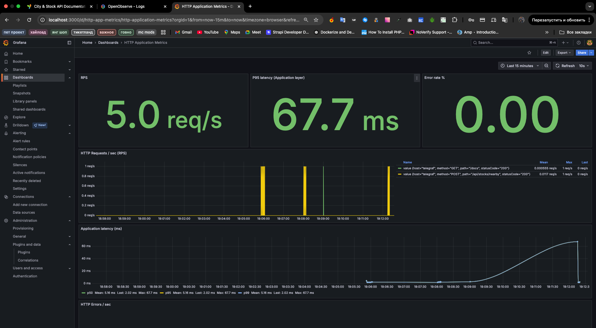
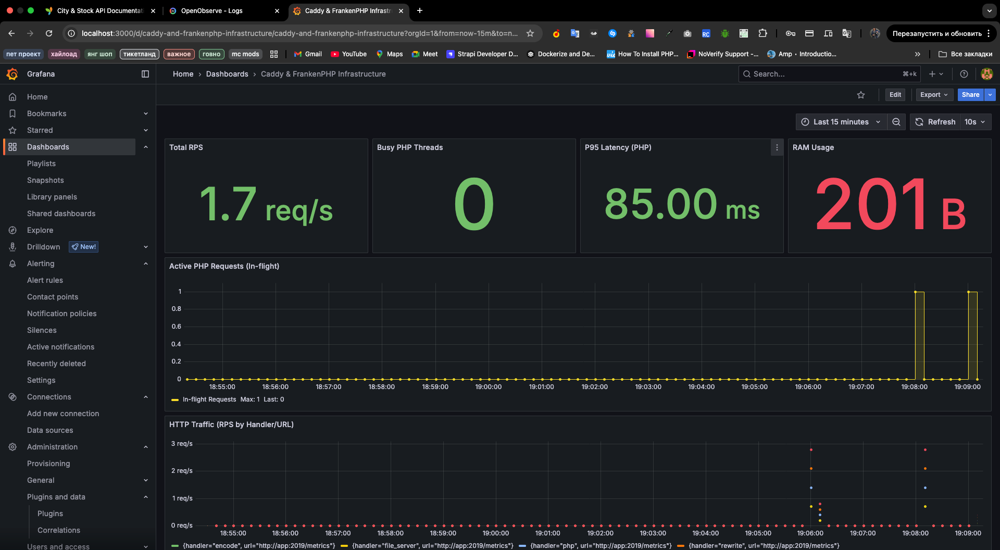
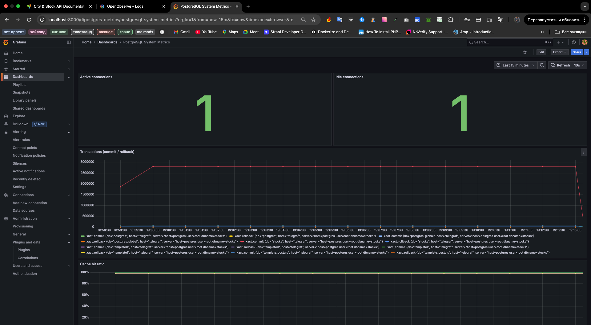
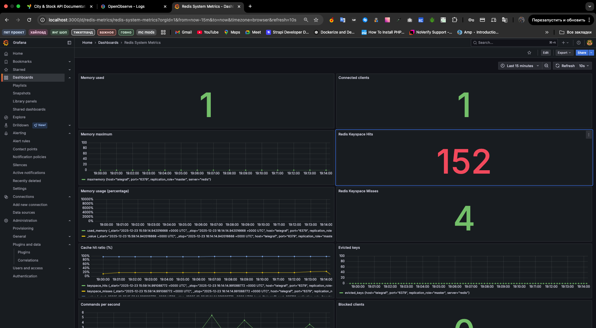
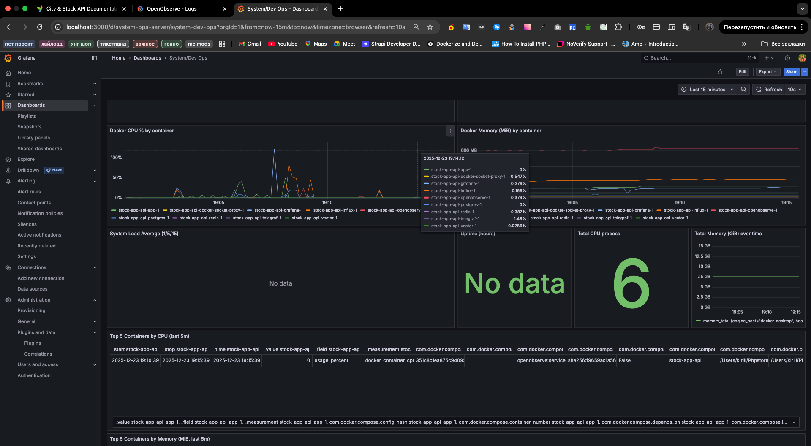

</details>

<details> <summary>🪵 OpenObserve Logs Viewer</summary>

Structured logs with `trace_id` and context fields.
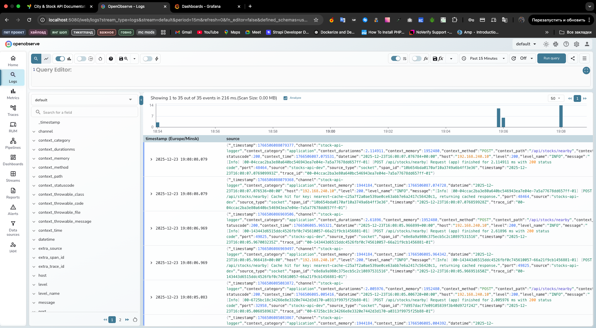
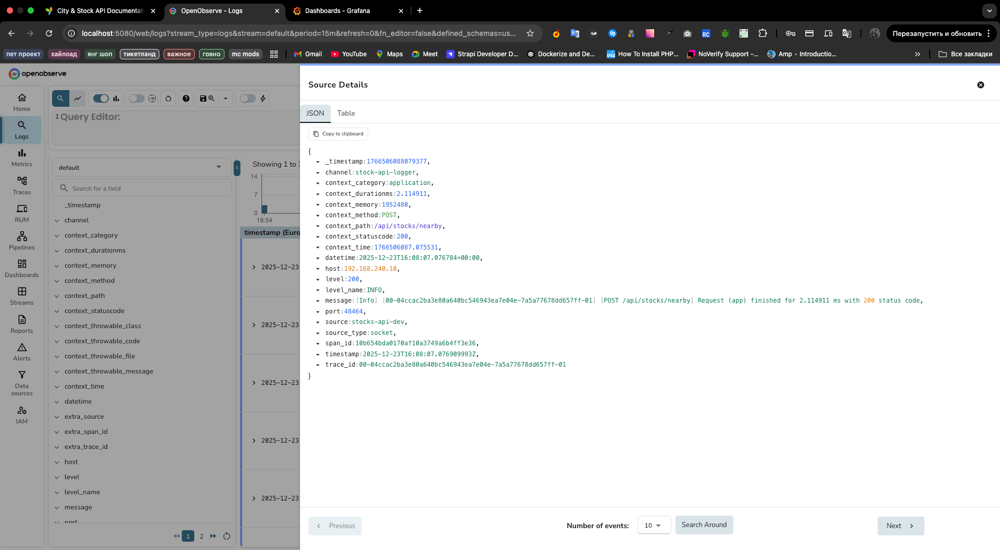
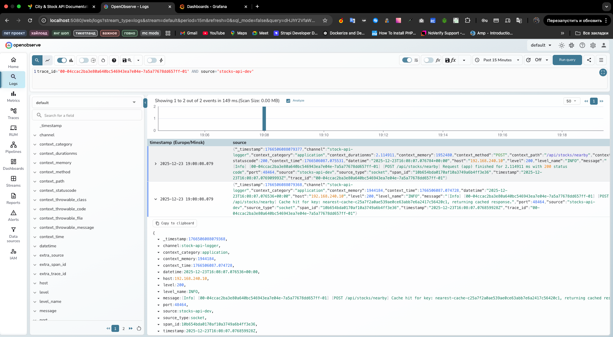

</details>

<details> <summary>📖 Interactive API Documentation (Stoplight)</summary>

Explore request/response schemas and test endpoints directly.
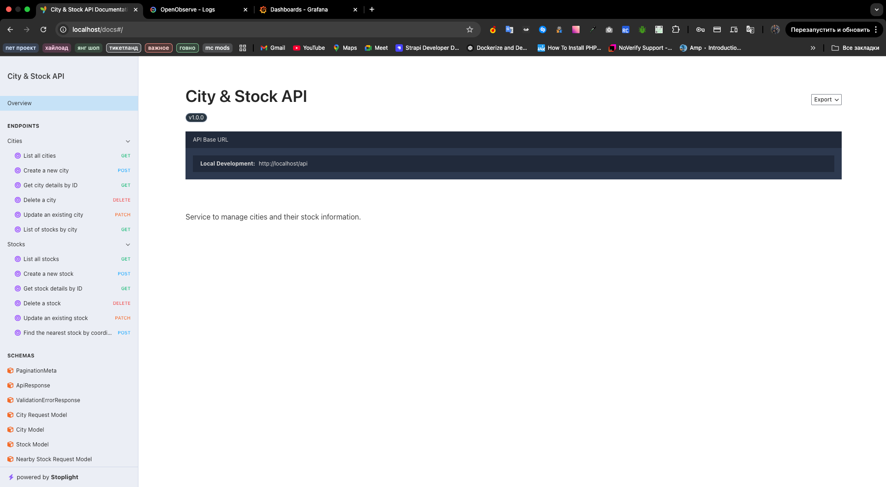
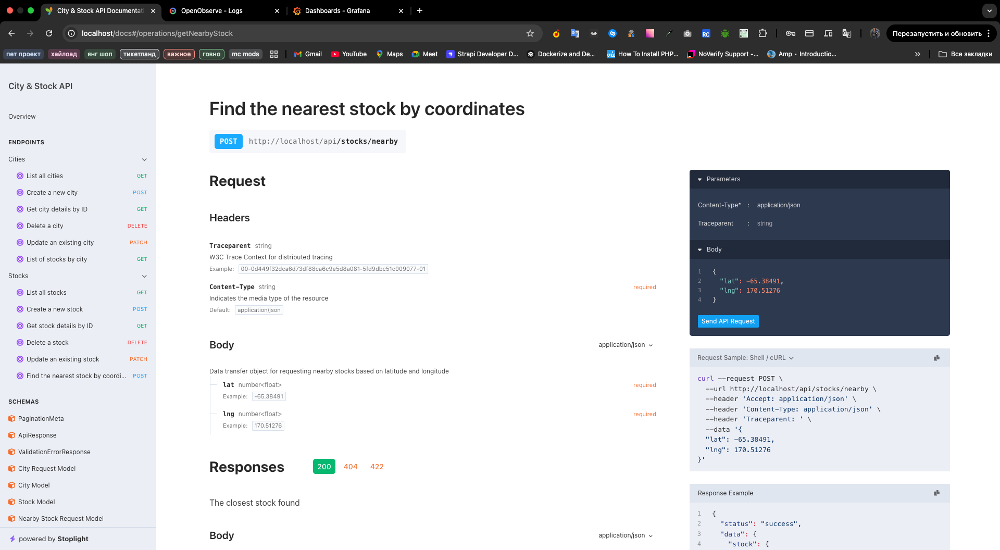
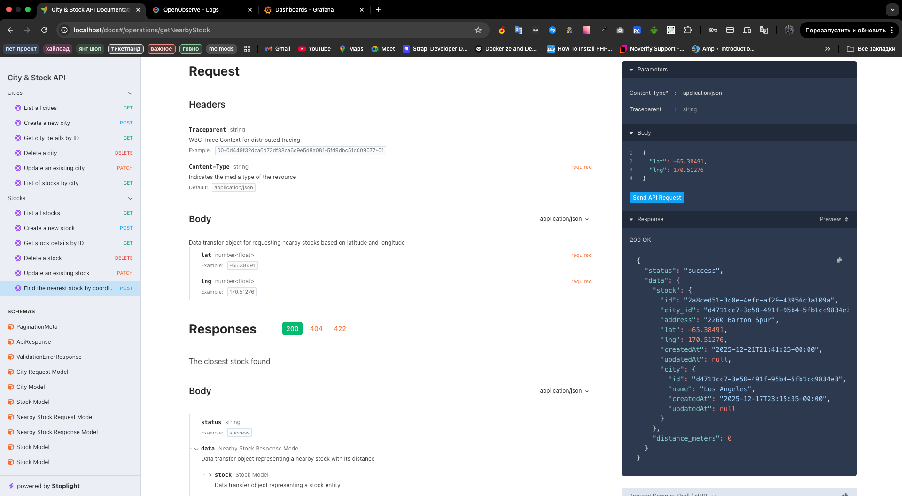

</details>

## ⚖️ License

This project is licensed under the [PolyForm Noncommercial License 1.0.0](LICENSE.md).

**Required Notice:** Copyright (c) 2024-2025 Kirill Sakharov (https://github.com/m1n64). All rights reserved.

*Note: This project is built upon the Yii3 Framework, which is licensed under the BSD-3-Clause License.*

Commercial use of this software is strictly prohibited under the terms of the PolyForm license.

### 💡 Engineering Exception & Disclaimer

I have deep respect for the **dev2dev community** - engineers who build tools for other engineers: framework core
developers, language contributors, and maintainers of low-level libraries.

Despite the Noncommercial license:

* **Permitted**: You are welcome to study, reference, or adapt architectural patterns and ideas from this
  repository for use in any **dev-focused** products, core frameworks (like Yii3), or low-level
  libraries.
* **Prohibited**: Integration into commercial end-products, "ready-to-use" SaaS templates, or redistribution
  within copyleft-restricted software suites is forbidden due to license incompatibility.

#### Why the restriction?

1. **Beta Status**: Yii3 is currently in its final pre-release stages, and this implementation should be treated as a
   work-in-progress on a beta-status framework.
2. **Showcase Only**: This code serves exclusively as a foundation for a technological showcase and
   architectural review.
3. **Technical Risks**: Due to the experimental nature of the current stack (Yii3 Beta), this code may contain
   security or stability vulnerabilities not suitable for production environments.

---

### 🤝 Author's Note

This project is a personal showcase of modern PHP 8.4 and Yii3 patterns. While not strictly using `form-model` in this
specific service, the author is an active contributor to the Yii3 ecosystem (see contributions to
`yiisoft/form-model`: [#83](https://github.com/yiisoft/form-model/pull/83)
and [#85](https://github.com/yiisoft/form-model/pull/85)).
